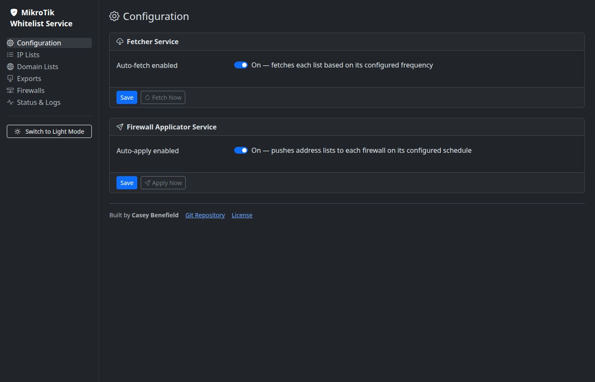
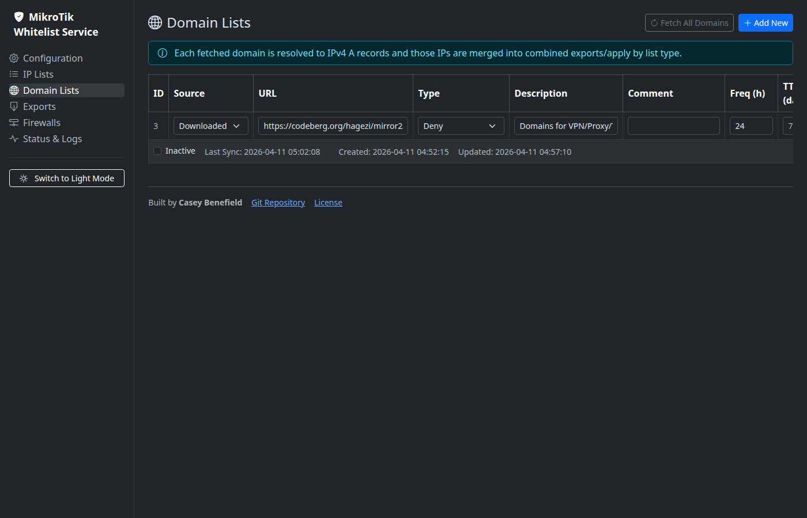
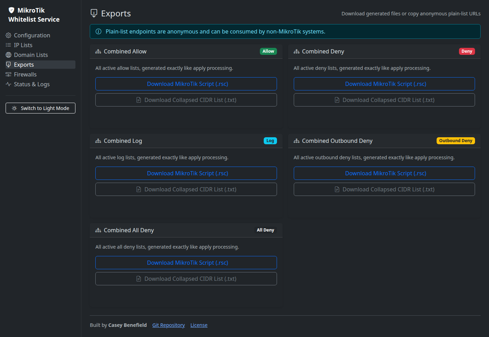
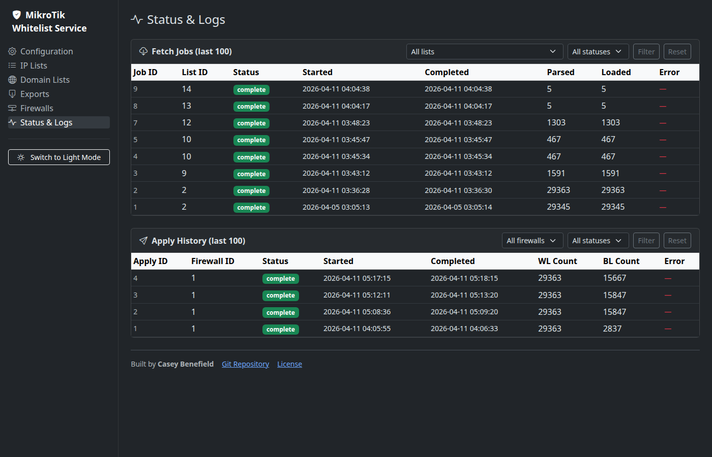

# Features

This page gives a visual overview of the main workflows in Mikrotik Whitelist Service.

## Core Capabilities

- Downloaded IP Lists and Domain Lists
- Five list types: Allow, Deny, Log, Outbound Deny, All Deny
- Per-list fetch frequency and per-list TTL
- Domain-to-IPv4 A-record resolution for Domain Lists
- Global exact-cover CIDR consolidation before router push
- Per-firewall manual apply and scheduled apply
- Status tracking for fetch and apply operations

---

## Configuration

Use the Configuration page to enable or disable the scheduled fetcher and applicator.



---

## IP Lists

IP Lists accept plain IPv4 addresses and CIDR blocks from downloadable sources or manual entry.


Typical use cases:

- Country allow lists
- Threat-intelligence deny lists
- Provider-specific allow lists
- Manual CIDR overrides

---

## Domain Lists

Domain Lists accept plain exact-match domain feeds. Each fetched domain is resolved to IPv4 A records, and those resolved IPs are merged into the same combined datasets used for router applies and exports.



Typical use cases:

- DNS-over-HTTPS and VPN bypass domains
- Malware or phishing domain IOC feeds
- Internal incident-response domain feeds

Notes:

- Wildcard, regex, adblock, and hosts-file formats are not supported directly.
- Only exact domains present in the source feed are resolved.

---

## Exports

The export center provides combined and per-list outputs in plain-text and RouterOS script formats.



Combined exports reflect:

- Active IP Lists
- Active Domain Lists after DNS resolution
- Deduplication and exact-cover CIDR collapse per list type

---

## Firewalls

Firewalls are defined once and can be updated or applied on demand from the UI.


Manual Apply Now behavior:

- Bypasses idempotency checks
- Shows live UI progress while generating and pushing
- Prevents duplicate concurrent applies for the same firewall

---

## Status And Logs

The status page shows recent fetch and apply history so you can troubleshoot failures and confirm current behavior.



Use this page to confirm:

- Fetch jobs are completing
- Domain lists are syncing
- Applies are reaching the firewall
- Entry counts changed after adding new feeds

---

## Consolidation Behavior

Before data is pushed to RouterOS, entries are reduced to the minimal exact-cover set for each list type.

This means:

- Duplicate IPs and CIDRs are removed
- Child CIDRs are dropped when already covered by a parent CIDR with equal or longer TTL
- Full contiguous `/32` coverage can collapse into a parent CIDR such as `/24`
- Partial ranges are not widened if that would block additional IPs not present in the source data

Example:

```text
192.168.0.0 through 192.168.0.255 -> 192.168.0.0/24
```

But this is not widened:

```text
192.168.1.1 through 192.168.1.255
```

That partial set is reduced to the smallest exact CIDR combination instead of being widened to `192.168.1.0/24`.

---

## Example Feeds

See these example documents for suggested sources:

- [examples/lists.md](examples/lists.md)
- [examples/domainlists.md](examples/domainlists.md)