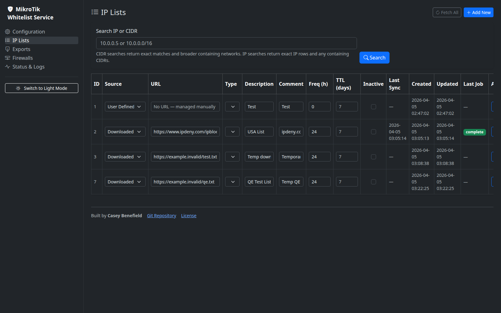
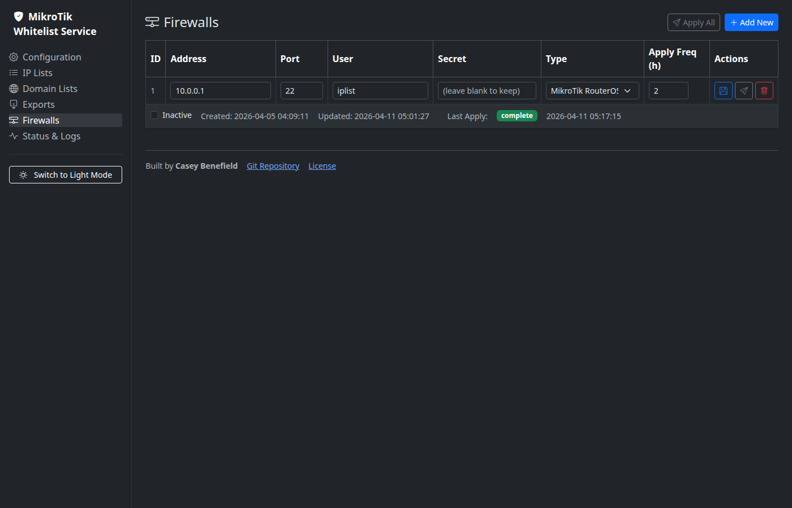

# Mikrotik Whitelist Service

A self-hosted Dockerized service that maintains dynamic IP address lists on MikroTik RouterOS 7 firewalls.

Instead of filtering at DNS level (like Pi-hole), this service operates at the **firewall/WAN address-list level**. It:

- **Fetches** IP block lists from configurable URLs (e.g. [ipdeny.com](https://www.ipdeny.com/ipblocks/) country zone files)
- **Fetches** exact-match domain block lists and resolves them to IPv4 A records
- **Consolidates** overlapping and adjacent CIDR ranges into the minimum covering set
- **Generates** RouterOS-compatible `.rsc` address-list scripts
- **Pushes** those scripts atomically to one or more MikroTik firewalls via SSH

A typical use case is allowing only traffic from a specific country (e.g. US-only WAN ingress) by maintaining a `ip-whitelist-dynamic` address list, or blocking known-bad IP ranges via `ip-blacklist-dynamic`. The router's own firewall rules decide how to use the lists — this service only manages the lists themselves.

---

## Why It Exists

- Keep dynamic RouterOS address lists current without manual imports
- Combine IP-based and domain-derived threat feeds in one workflow
- Push exact, deduplicated, collapsed list data instead of raw noisy feeds
- Let MikroTik firewall policy stay in MikroTik while this service manages the data pipeline

---

## Features

| Feature | Detail |
|---|---|
| Multi-source IP and Domain Lists | Separate downloaded or manual sources for IPs and exact-match domains |
| Five policy list types | Allow, Deny, Log, Outbound Deny, and All Deny |
| Domain resolution | Domain Lists resolve exact domains to IPv4 A records before export/apply |
| Exact-cover CIDR consolidation | Duplicate and overlapping entries are reduced to the minimal exact CIDR set per list type |
| Atomic apply | Old address list is removed before new one is added in one RouterOS operation |
| Hash-based idempotency | Skips push if list content hasn't changed since last successful apply |
| Per-list fetch frequency | Each list has its own schedule (in hours); 0 = manual only |
| Per-list TTL | Each IP List or Domain List can use its own dynamic timeout |
| Per-firewall apply frequency | Each firewall has its own push schedule; 0 = manual only |
| Job tracking | Every fetch and apply is logged to the database with status and error details |
| Web UI | Bootstrap-based UI for configuration, IP Lists, Domain Lists, exports, firewalls, and logs |
| Encrypted secrets | Firewall passwords are AES-256-GCM encrypted at rest; decrypted only in memory at apply time |

---

## Architecture

```
┌──────────────┐     ┌────────────────┐     ┌──────────────────┐
│   Fetcher    │────▶│   PostgreSQL   │◀────│    Applicator    │
│  (scheduler) │     │  (iplist schema│     │    (scheduler)   │
└──────────────┘     │   + volumes)   │     └──────────────────┘
                     └───────┬────────┘
                             │
                     ┌───────▼────────┐
                     │   FastAPI UI   │
                     │ (API_PORT env) │
                     └────────────────┘
```

Four Docker services:
- **postgres** — PostgreSQL 18 with persistent volume
- **api** — FastAPI web UI + internal trigger endpoints; runs `alembic upgrade head` before starting
- **fetcher** — Scheduled download and DB load of IP lists
- **applicator** — Scheduled generation and SSH push of RouterOS scripts

---

## Screenshots And Feature Tour

See [features.md](features.md) for a guided feature walkthrough and [screenshots.md](screenshots.md) for a dedicated screenshot gallery.

Quick preview:





---

## Quick Start

See [install.md](install.md) for full step-by-step instructions.

Useful example sources:

- [examples/lists.md](examples/lists.md) for IP-based feeds
- [examples/domainlists.md](examples/domainlists.md) for exact-domain feeds

```bash
cp examples/.env.example .env
# Edit .env with your database password and encryption key
docker compose up -d
```

Open `http://localhost:<API_PORT>` in your browser. With the default configuration, that is [http://localhost:8000](http://localhost:8000).

---

## Configuration (`.env`)

| Variable | Description |
|---|---|
| `POSTGRES_USER` | PostgreSQL username |
| `POSTGRES_PASSWORD` | PostgreSQL password |
| `POSTGRES_HOST` | PostgreSQL host (use `postgres` inside Docker) |
| `POSTGRES_PORT` | PostgreSQL port (default `5432`) |
| `POSTGRES_DATABASE` | Database name (default schema is `iplist`) |
| `API_PORT` | Port exposed for the FastAPI UI (default `8000`) |
| `ENCRYPTION_KEY` | 64-character hex AES-256 key — generate with `openssl rand -hex 32` |
| `FETCH_TIMEOUT_SECONDS` | HTTP download timeout per request (default `30`) |
| `FETCH_RETRIES` | Download retry attempts before failing (default `3`) |
| `APPLY_TIMEOUT_SECONDS` | SSH command timeout per push (default `60`) |
| `LOG_LEVEL` | `DEBUG`, `INFO`, `WARNING`, or `ERROR` (default `INFO`) |

---

## How Lists Work

1. Add a list entry on the **IP Lists** page with a URL pointing to a plain-text file of IPv4 addresses or CIDR blocks (one per line).
2. Or add a list entry on the **Domain Lists** page with a URL pointing to a plain-text file of exact domains (one per line).
3. Set `Type` to **Allow**, **Deny**, **Log**, **Outbound Deny**, or **All Deny**.
4. Set a `Fetch Frequency` in hours, or leave at `0` for manual-only.
5. Click **Add & Fetch** — downloadable lists begin processing immediately.

IP Lists accept IPv4 addresses and CIDR blocks.

Domain Lists accept exact domains only and resolve them to IPv4 A records before they are merged into the same combined datasets used for exports and router applies.

### Supported IP source formats

- One CIDR per line: `1.2.3.0/24`
- Plain IPv4 address (treated as `/32`): `1.2.3.4`
- Lines starting with `#` or `;` are treated as comments and skipped
- Inline `#` and `;` comments are stripped

### Supported domain source formats

- One exact domain per line: `bad-domain.example`
- Lines starting with `#` or `;` are treated as comments and skipped
- Inline `#` and `;` comments are stripped

These are not supported directly:

- `||example.com^`
- `*.example.com`
- `0.0.0.0 example.com`
- Regex-style patterns

[ipdeny.com](https://www.ipdeny.com/ipblocks/) `.zone` files and HaGeZi `domains/*.txt` feeds are good starting points.

---

## RouterOS Address Lists

The applicator pushes these named address lists:

| List name | Source |
|---|---|
| `ip-whitelist-dynamic` | All active IPs from Allow lists, collapsed |
| `ip-blacklist-dynamic` | All active IPs from Deny lists, collapsed |
| `ip-log-dynamic` | All active IPs from Log lists, collapsed |
| `ip-outbound-deny-dynamic` | All active IPs from Outbound Deny lists, collapsed |
| `ip-all-deny-dynamic` | All active IPs from All Deny lists, collapsed |

Entries are added with a `timeout` (TTL) so they are **dynamic** — stored in router RAM, not flash. The TTL resets on each apply. If the service stops applying, entries expire automatically after the configured TTL.

Allow/deny overlap handling is left to your MikroTik firewall rules — the service does not enforce precedence between the two lists.

Combined export and apply datasets are deduplicated and reduced to the minimal exact-cover CIDR set for each list type before being pushed to RouterOS.

---

## License

See [LICENSE](LICENSE).

---

## Disclaimer

- This project is provided **as-is**, with **no warranty** of any kind.
- You are responsible for implementing and maintaining appropriate security controls, including authentication, authorization, network segmentation, and access restrictions.
- This software was intended for **internal use in a home lab** environment.
- I am not responsible for any damage that occurs resulting from your use of this software.
